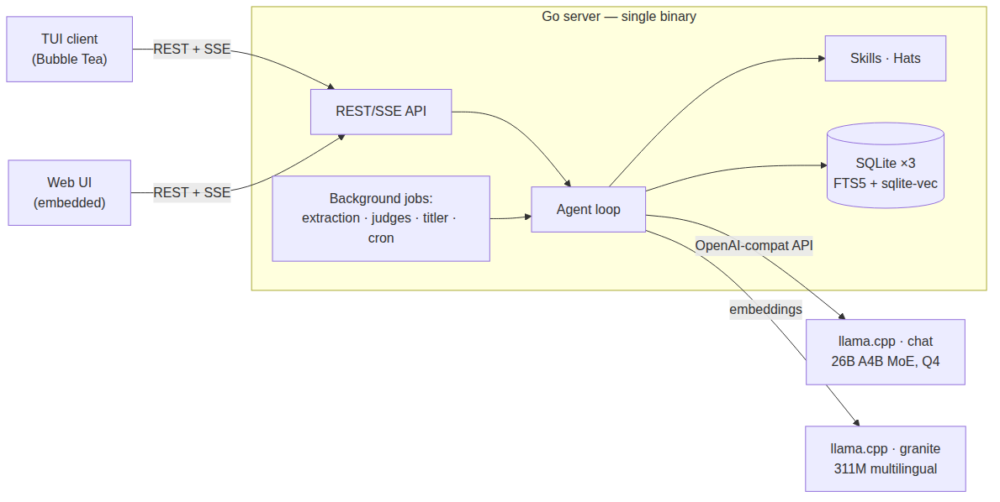
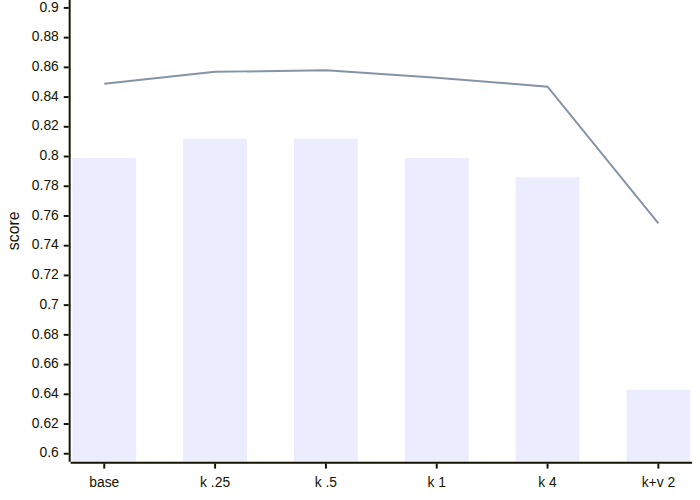

## Thesis

- Agent harnesses are oddly **local**: one user, one process, cloud LLM
- Harlequin: a **client-server** agent system — REST/SSE server, thin clients
- …optimised for a **local model**: one GPU, slow tokens, every token paid in latency
- Research project · Go · SQLite · goja JS sandbox

. . .

Two tensions drive every design decision in this talk:

1. **The GPU is a contended resource**
2. **Every token costs latency**

::: notes
Frame the talk: the interesting engineering is in the intersection —
multi-user expectations (memory, notifications, background work) colliding
with a single slow local model.
:::

## Demo


::: notes
Demo: the TUI asking for a watch price — WebFetch with anti-bot fetching, a
delegated small-model analysis, and the answer with per-turn PP/TG timing.
Let it loop while introducing the architecture.
:::

## Architecture in one slide



- Provider router with fallback (local → hosted API)
- Multi-user, role-aware (owner / admin / user), per-org

## Local-model-optimised

|  |  |
|---|---|
| Reference rig | gemma-class **26B** (A4B MoE), Q4, 120k ctx, llama.cpp `-np 2` |
| Prompt processing | **~225–350 tok/s** (degrades with depth) |
| Token generation | **~24–28 tok/s** |
| 21k-token prompt, cache miss | **≈ 95 s** before the first new token |

::: incremental
- Dynamic per-request deadlines from a rolling PP-rate estimate — no fixed timeouts
- Live prompt-processing progress streamed to the client (`return_progress`)
- Cloud-API instincts (retry, fan out, "just make another call") must be unlearned
:::

::: notes
Cloud-API thinking does not transfer: timeouts, retries, and parallel calls all
have to be re-derived when PP is 300 tok/s and TG is 25.
:::

## One GPU, many jobs

Background LLM work: memory extraction, conflict judges, auto-titling, maintenance sweeps

:::: columns
::: {.column width="50%"}
### Naive

Background jobs share llama.cpp slots with live turns → interleaved inference, everything slow

Worst at server start: a memory sweep degraded user turns **for minutes**
:::
::: {.column width="50%"}
### Harlequin

Single background slot + **preemption**: a live turn cancels the in-flight background completion; the job restarts later (restartable by design)

Measured: turn preempts a running judge in **< 1 s**
:::
::::

Gating keys off the provider: only the `local` provider serializes — hosted APIs run background work in parallel.

::: notes
War story: "two prompts at once" turned out to be three separate ungated paths
— extraction's judge calls, the auto-titler, and a startup cross-scope sweep.
Found by tailing llama.cpp slot logs (launch/release lines per task). The
debugging method is as interesting as the fix for this audience.
:::

## KV-cache economics

| Case | Tokens processed | Wall time |
|---|---|---|
| Mid-turn step (prefix matches KV) | [~150 of 21k]{style="color:#a8f0a0"} | [~3 s]{style="color:#a8f0a0"} |
| New turn, thinking model | [21,176 of 21,176]{style="color:#f0a0a0"} | [94 s]{style="color:#f0a0a0"} |

::: incremental
- Reasoning tokens are **in the KV but stripped from replayed history** → prefix diverges every turn
- SWA models can't partially rewind → all-or-nothing without checkpoints
- Mitigations, measured: `--swa-full` (VRAM ↑) · context checkpoints (~106 MiB each, host RAM, share the `--cache-ram` budget) · replay thinking (ctx ↑3k/turn)
- Harness rule: keep the prompt prefix **byte-stable** — deterministic tool order, stable system prompt
:::

::: notes
Verified empirically: system prompt byte-identical across 6 turns (sha1 diff of
session logs), so the miss was NOT app-side. llama.cpp's n_past logs show where
reuse happens. Good "measure, don't guess" moment.
:::

## Client-server

- Why: shared org memory, roles, usage accounting, **one GPU for the whole org**
- REST + SSE; turns stream tokens, thinking, tool calls, PP progress
- *Interfaces*: each session tagged with its medium — TUI, Web, Cron, Telegram
- Messages queue while a turn is in flight; `ask_user` ends the turn cleanly
- TUI and web client kept at feature parity

::: notes
Contrast with laptop-local harnesses: identity, authz, and audit are
first-class. The agent loop runs server-side, so any thin client works.
:::

## Single-executable deployment

- One Go binary: skills, hats, SQL migrations, web UI — all `embed.FS`
- SQLite compiled in (CGO + sqlite-vec); vendored headers, **no system deps**
- Baked assets deployed to the data dir with a hash manifest — local edits preserved, unchanged files upgraded
- Config: YAML for structure, `.env` for secrets, env overrides

```sh
make build   # CGO_ENABLED=1, -tags sqlite_fts5
scp bin/harlequin-server you@box: && ./harlequin-server
```

::: notes
Ops story: a single file + a data directory. The deploy-with-manifest trick is
the interesting part — it's how baked skills coexist with local edits.
:::

## SQLite everywhere

Three tiers, all WAL:

```text
data/harlequin.db          system: users, tokens          (kept open)
data/shared.db             org: shared memories, docs     (kept open)
data/users/<id>/user.db    memories, conversations, cron  (opened per request)
```

- Per-user DBs opened per request, closed after — thousands of users, no connection pools
- No cross-file foreign keys: composite ids (`u.4` / `s.7`) fuse the tiers in code
- FTS5 + `sqlite-vec` in the same file: full-text and vector search **next to the data**
- Backup = copy a directory; per-user isolation by construction

::: notes
"Why not Postgres+pgvector?" — deployment story (single binary, zero services)
and per-user isolation. Be honest about limits: write concurrency per file,
EachUser sweeps are sequential.
:::

## Embeddings to speed things up

- 311M multilingual embedder (granite) on its own llama.cpp — cheap, always available
- Hybrid retrieval: FTS5 + vector legs fused with **Reciprocal Rank Fusion**
- Embeddings as a **pre-filter for LLM judges**: only top candidate pairs reach the 26B model
- Slot keys (`user.preferred_currency`) get their own embedding leg

> **Theme:** the 311M model runs constantly so the 26B model runs rarely.

::: notes
Conflict detection embeds + searches first, judges only candidates. This is the
cost-control pattern repeated across the whole system.
:::

## Measured: slot-key embedding leg

[1,000 synthetic org memories · 154 sloppy user queries · granite-embedding-311m]{style="opacity:0.6;font-size:0.7em"}

:::: columns
::: {.column width="48%"}
| Variant | R@1 | MRR |
|---|---|---|
| baseline (FTS + vec, RRF) | 0.799 | 0.849 |
| + key leg, w=0.25 | **0.812** | 0.857 |
| + key leg, w=0.50 | **0.812** | **0.858** |
| + key leg, w=4.0 | [0.786]{style="color:#f0a0a0"} | 0.847 |
| + key**+value**, w=2.0 | [0.643]{style="color:#f0a0a0"} | [0.755]{style="color:#f0a0a0"} |

: {tbl-colwidths="[60,20,20]"}
:::
::: {.column width="52%"}

[bars R@1 · line MRR]{style="opacity:0.6;font-size:0.6em"}
:::
::::

::: notes
Two lessons: (1) modest, weighted extra legs sharpen the top rank; (2)
embedding the *value* into the slot vector actively hurts — attribute lookups
ask FOR the value, so value text is noise against the query. Over-weighting
boosts everything sharing an attribute key and pushes the exact entity off
rank 1.
:::

## The memory model

- Two scopes: **user** (personal) and **shared** (org) — fused into one search view
- Slot keys: canonical attributes (`organisation.name`) — idempotent writes, exact lookups
- Auto-extraction after each turn (background, preemptible), deduped against explicit writes
- Conflict detection on write: FTS+vector candidates → LLM judge, structured JSON, **confidence ≥ 7 gate**
- Provenance, TTL, pinning; cross-scope reconcile (an attribute can't live in both scopes)
- Memory glob rendered into the system prompt; the rest recalled via `memory_search`

::: notes
Emphasize the autonomous-judgment rule: every unattended LLM decision carries a
self-reported confidence and is discarded below 7 — silence over placeholder
garbage. A harness-level convention, not per-feature.
:::

## Hats

A **hat** = persona per conversation: own system prompt + curated skill set

```yaml
---
description: Maintains the organisation's website.
skills: [example-greeter]
---
You are Harlequin acting as the organisation's **webmaster**…
```

- Markdown + frontmatter, JS-templated (`<?js ?>`), baked & overridable like skills
- Keeps the **default** prompt small — important when PP costs 95 s

## Notifications & polling

- Server-side notification store; clients **poll once a minute** + ack/dismiss
- Why polling: clients are ephemeral TUIs — presence tracking decides who gets pinged where
- Outbound channels: in-app, email (SMTP), Telegram — per-user config
- Producers: web-watch cron checks (JS, **no LLM**), auto-titler, `ask_user`, scheduled skills

| Cron kind | Runs | Cost |
|---|---|---|
| `js` | sandboxed script, DOM diff | zero LLM tokens |
| `skill` | full agent turn | a whole conversation |

::: notes
The js-vs-skill cron split is the cost story again: a page-change watcher runs
every 30 min for free; the LLM only wakes up when something changed.
:::

## No bash. JS!

:::: columns
::: {.column width="50%"}
### [Pro: security]{style="color:#a8f0a0"}

- goja sandbox: no filesystem, no exec, no network except allow-listed `fetch`
- Hard interrupt timeout, output caps
- Per-user virtual stores (`tmp://`, `storage://`) instead of paths
- Multi-user server: arbitrary shell was never an option
:::
::: {.column width="50%"}
### [Con: flexibility]{style="color:#f0a0a0"}

- ES5.1 + much of ES6 (goja) — no npm, no node APIs
- No external tools or pipes; everything via injected helpers (`dom.*`, `fetch`)
- Long-tail tasks need a helper added server-side first
:::
::::

[Same sandbox everywhere: `run_js` tool · skill templating · skill-defined tools · cron jobs]{style="font-size:0.8em;opacity:0.8"}

::: notes
Live anecdote: asked for 200 digits of π, the model wrote a Machin-formula
arctan series with BigInt in the sandbox, first try had a sign bug, second try
correct — verified against mpmath. Algorithm-not-recall is enforced by the
system prompt; the sandbox makes it safe to let a model run code on a shared
server.
:::

## Making a 26B model behave

- System prompt engineering for small models: short sections, one rule per bullet, **examples over abstractions**, mechanical decision rules
- "Computed answers": single expression → calculator; multi-step → `run_js`; the answer must repeat tool output **exactly**
- Judges: structured JSON + confidence gate (≥ 7) for every unattended decision
- Grounding: tool output is **data, not instructions** (web content!); "don't know" beats guessing

> Same 26B model, same question ("first 200 digits of π"):
> **before** — recites digits from its weights, ignores its own buggy script;
> **after** — writes a BigInt Machin series, self-corrects, answers from tool output. Verified against mpmath.

::: notes
ML experts will appreciate that harness design substitutes for model
capability: the same model fails or succeeds depending on prompt structure and
verification loops.
:::

## Numbers recap

| Thing | Number |
|---|---|
| Chat model PP / TG (26B A4B, Q4, single GPU) | ~225–350 / ~24–28 tok/s |
| 21k-token prompt, cold | ~95 s |
| 21k-token prompt, KV hit (mid-turn) | ~3 s |
| Background job preempted by a live turn | < 1 s |
| SWA context checkpoint (this model) | ~106 MiB host RAM |
| Slot-key retrieval lift (MRR) | 0.849 → 0.858 |
| Memory eval corpus | 1,000 memories · 154 queries |
| External services required | 0 (binary + llama.cpp) |

## Takeaways

- Local models change harness design: **schedule the GPU** like a contended resource
- Keep prompt prefixes byte-stable; know your KV cache (SWA ≠ free reuse)
- Small embedders everywhere; the big model only behind candidate filters + confidence gates
- SQLite + `embed.FS` = an org-grade agent server that deploys as one file
- Sandboxed JS beats shell for multi-user agents — and costs you npm

<br>

[`github.com/ivoras/harlequin` · questions?]{style="opacity:0.7"}
